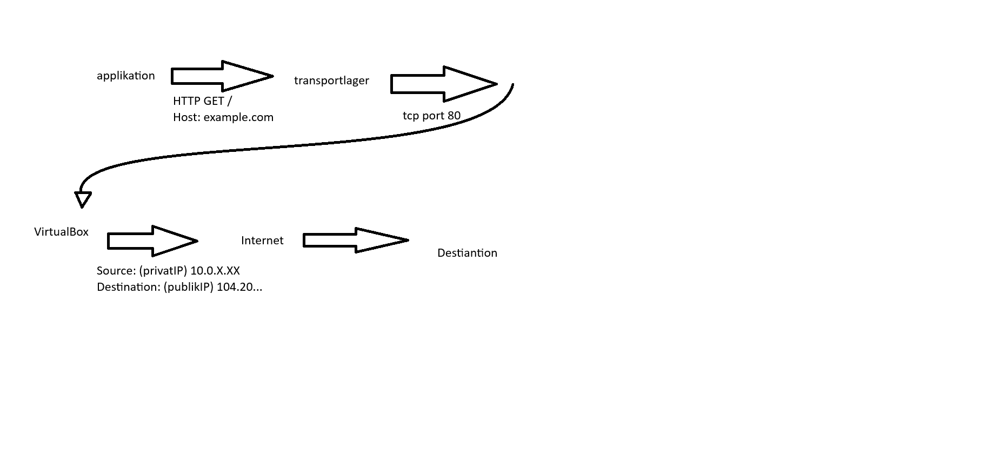

# Network traffic investigaiton

# del A miljö och metod

miljö som används var lokal  linuxVM med kali i virtualbox
trafik var fångad med tcpdump och frafikmix.sh (egen fångst)
jag har begränsad fångsten med timeout (20s)
jag tog skärmbilder som evidens som var sanerad för ip addresser och annat känslig info

# del B paketets väg

#### [X] observation från pcap

#### [Förklaring] egen förklaring

**[X]** från pcap filen kan man observera att mitt VM använder addressed 10.2... och komunicerar med den publika IPn 104... över tcp port 80

**[Förklaring]** 10.2.. är en privat IP som min VM använder. För att trafik från min VM till ska kunna nå en publik destination används en gateway och natpat. NAT översätter den privata adressen till en adress som kan användas utanför privata nätverket och PAT tar hand om portar och anslutningar

**[X]** I pcap-filen kan man också se DNS-trafik där min VM skickar en fråga efter example.com och får ett svar. 

**[Förklaring]** default route bestämmer vilken väg trafiken ska ta när destinationen finns utanför det lokala nätverket. I min VM går trafiken via den virtuella gatewayen.

**[X]** I pcap filen kan man se att TCP används och att destinationens port är 80. Man kan också observera handshaken syn, syn/ack, ack.

**[Förklaring]** en brandväg kan vara en "filter" som tillåter eller blockerar trafik beroende på saker som protokol, adress eller port

# del C protokollinventering

| Protokoll | Minsta evidens | Analys |
|---|---|---|
**DNS** | **[X]** DNS query och en  response för example.com kunde observeras. | **[X]** Frågan gäller example.com och ett svar kommer tillbaka. Detta visar att DNS fungerade.|
**ICMP** | **[X]** Echo Request/Reply par kunde observeras  | **[X]** Min VM skickar en Echo Request och får en Echo Reply. Detta visar att destinationen var nåbar från VMn. |
**TCP** | **[X]** TCP handshake med SYN, SYN/AC och ACK kunde identifieras. | **[X]** TCP anslutningen kan identifieras genom handshaken, endpoints, portar kan observeras. HTTP använder port 80, HTTPS använder port 443. |
**HTTP** | **[X]** HTTP request kunde observeras på port 80. | **[X]** GET/, example.com och annan HTTP info är läsbar i pcap filen. |
**TLS/HTTPS** | **[X]**  Client och server hello kunde observeras på port 443. | **[X]**  TLS version och server namn example.com kan observeras. innehållet är inte läsbart som vanlig HTTP-data eftersom det är krypterat. |

# del D fördjupad analys av två flöden

### HTTP

**Paket/flödeshänvisning:** packet 20

**Källa, destination, port och protokoll:** källa VM, destination upblika IPn 104.20..., HTTP över TCP port 80

**Händelseordning:** tcp handshaken, efter det skickas förfrågan med GET / och host example.copm

**Förväntat beteende:** för HTTP förväntas TCP anslutning och efter förfrågan skickas över anslutningen

**Faktisk observation:** observationen stämmer med förväntad beteendet. HTTP förfråga innehöll bl.a GET och host example.com

**Avvikelse:** en RST-ACK fanns men inte säkert om det tillhör just denna förfrågan

**Alternativa förklaringar:** /

**Vad behövs för en säkrare slutsats:** för en säkrare slutsats skulle man behöva analysera hela TCP flödet 

### HTTPS

P**Paket/flödeshänvisning:** paket 37

**Källa, destination, port och protokoll:**  källa VM, destination upblika IPn 104.20..., HTTPs över TCP port 443

**Händelseordning:** tcp handshaken, efter det kan man se en hello server och hello client och example.com som server namn

**Förväntat beteende:** för HTTPs förväntas TCP handshake anslutning och efter en TLS handshake efter det skickas krypterad trafik genom anslutningen

**Faktisk observation:** observationen stämmer med förväntad beteendet. TLS 1.3 och client och server hello kunde observeras men innhållet kunde inte läsas eftersom det var krypterad

**Avvikelse:** /

**Alternativa förklaringar:** /

**Vad behövs för en säkrare slutsats:** för en säkrare slutsats skulle man behöva analysera hela TCP flödet 

# del E krypterat och okryptera

| Aspekt | HTTP | TLS/HTTPS |
|---|---|---| 
**Synlig metadata** | Källa, destination och port 80 kan observeras. Host: example.com och URI / är också synliga. | Källa, destination och port 443 kan observeras samt TLS Client Hello, TLS-version och server name example.com kan observeras |
 **Läsbar applikationsdata** | HTTP data är läsbar. I flödet kunde GET/ och host: example.com ses i Wireshark. | innehållet kunde inte läsas som vanlig HTTPdata. men TLS handshake och metadata kunde  observeras. |
**Felsökningsvärde** | Det går att analysera HTTP-metod, URI, host och andra headers direkt, vilket gör det lättare att se vad klienten skickar. |Även med kryptering kan man analysera IP-adresser, port 443, TCP-handshake, TLS client hello och server namn. Innehållet kan inte analyseras på samma sätt. | 
**Konfidentialitetsrisk** | Information som skickas i HTTP kan läsas direkt i en paketfångst.  GET/ och host: example.com är synliga. | Själva data är krypterad och kan inte läsas direkt i wireshark. metadata, IP adresser, port 443 och server namn , är fortfarande synliga. |

# del F brandvägg och hardening

i wireshark såg jag http trafiken from min VM till example.com på 80 port brandväggen som beror detta är kanske den som tillåter tcp trafik på port 80

*lokal tjänst* är en tjänst som t.ex lyssnar på en specific port med den är *brandväggen* som faktiskt tar belsut om trafiken får passera eller inte

med *defautl deny* är defaulten att trafik blockeras och bara trafik som behövs kommer igenom detta följer principen minsta nödvändiga öppning, som tillåter bara portar och protokol som behövs.

i min wireshark såg jag DNS ICMP HTTP och HTTPS dessa används av trafikgenerator och var därför rimliga. från *hardenings* perspektiv ska det observerade trafiken kunna motiveras fron miljöns behov.

# del G CIA och evidens

**Konfidentalitet** 
Info som bör skyddas i pcap filen är ip addresser särskilt HTTP trafik eftersom metadatan finns i fångsten. TLS jämfört visar bara ip adresseer, port och example.com men själva datan kunde inte läsas.

**Integritet**
analysen gjordes på min pcap fil som genererats från trafikgenerator. paktenummer som HTTP paket 20 eller TLS paket 37 används för att koppla observbation till trafieken, pcap laddades inte upp på github utan bara screenshots med känslig data borttaget

**Tillgänglighet**
dns fråga och svar visar att det fungerar, Handshake visar att transporten funkar och ICMP visar att 8.8.8.8 kan nås

**Evidentskvalitet**
den var ganska kort bara 20-30s. fångsten gjordes in ett VM därför kanske nån trafik ha missats och vi kunde inte se brandväggens config.

# del H slutsats och rekommendation

i analyserade trafiken kunde flera protokol observeras som DNS, ICMP TCP/TLS.

Observationer som ör starkast underbyggda är de som vi faktisk kan se i wireshark som t.ex HTTP GET och Host. exmpel.com eller hur vi kunde se hela pr9ocessen av hur en handshake skapar en säkert anslutning.

osäkerheter som återstår är att fångsten var ganska kort och saker som vi kan inte se i wireshark som brandvägg konfiguration osv

bra säkerhetsåtgärd är att bara trafiken som behövs tillåts och bara att dem nödvändiga portar lyssnar på inkommande trafik